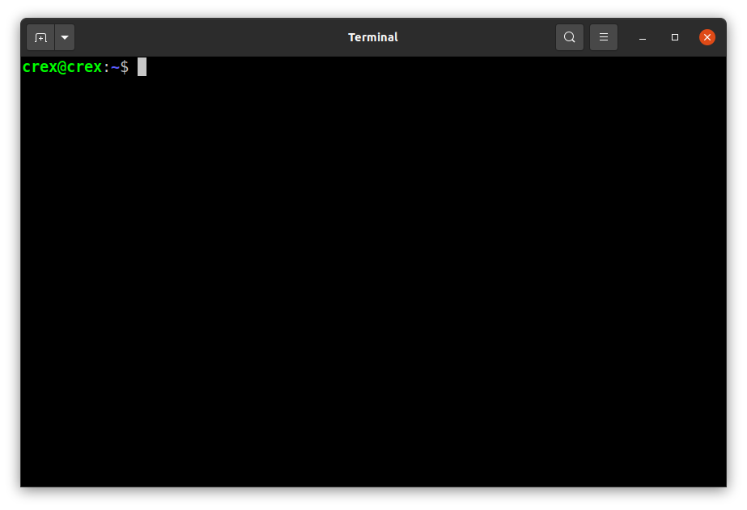

## Bienvenue sur la page Web de GitLearn!

Cette page web est destinée à vous proposer une série d'exercices en accompagnement des modules de formation.

Le module 0 de présentation des VCS étant un module très théorique je n'ai pas vraiment de manipulation technique à proposer. Il s'agit essentiellement de bien comprendre les notions de versionnement, de branches de versions (avec tout ce que ça implique: les fusions de branches, etc.) et de conflits.

Une fois que ce module 0 aura été bien compris, téléchargez et installez Git Bash (utilisateurs Windows) ou Git (utilisateurs Linux) en suivant ce [lien vers le site officiel de Git](https://git-scm.com/) et rejoignez-nous ici!

<!-- ##### Table of Contents
[Les terminaux de commande ou CLI](#interlude)                                
[Git : mode d'emploi pour un usage seul, sans dépôt distant, sur une seule branche](#usage_seul_local_monobranche)                                         
[Git : mode d'emploi pour un usage seul, avec dépôt distant](#usage_connecte)
[Git : mode d'emploi pour un usage collaboratif](#usage_collaboratif) -->
##### Table des matières
- [Bienvenue sur la page Web de GitLearn!](#bienvenue-sur-la-page-web-de-gitlearn-)
  * [Les terminaux de commande ou CLI](#les-terminaux-de-commande-ou-cli)
  * [Git : mode d'emploi pour un usage seul, sans dépôt distant, sur une seule branche](#git---mode-d-emploi-pour-un-usage-seul--sans-d-p-t-distant--sur-une-seule-branche)
  * [Git : mode d'emploi pour un usage seul, sans dépôt distant, avec une ou plusieurs branches](#git---mode-d-emploi-pour-un-usage-seul--sans-d-p-t-distant--avec-une-ou-plusieurs-branches)
  * [Git : mode d'emploi pour un usage seul, avec dépôt distant](#git---mode-d-emploi-pour-un-usage-seul--avec-d-p-t-distant)
  * [Git : mode d'emploi pour un usage collaboratif](#git---mode-d-emploi-pour-un-usage-collaboratif)

### Les terminaux de commande ou CLI

Dans Windows ouvrez Git Bash ou un terminal de commande sous Linux (Ctrl + Alt + T). Vous devriez obtenir une fenêtre similaire à celle-ci:

### Git : mode d'emploi pour un usage seul, sans dépôt distant, sur une seule branche

### Git : mode d'emploi pour un usage seul, sans dépôt distant, avec une ou plusieurs branches

### Git : mode d'emploi pour un usage seul, avec dépôt distant

### Git : mode d'emploi pour un usage collaboratif
