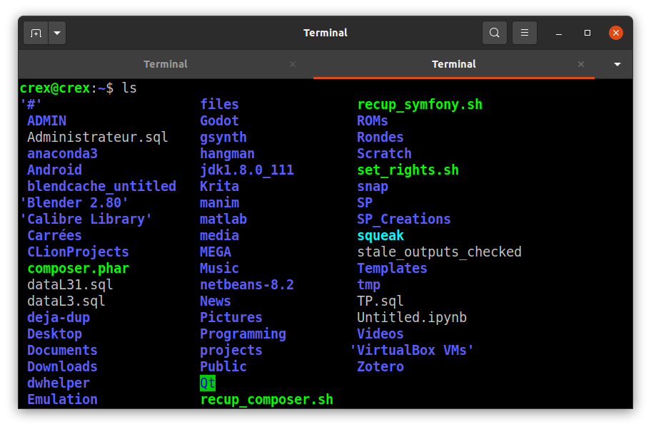
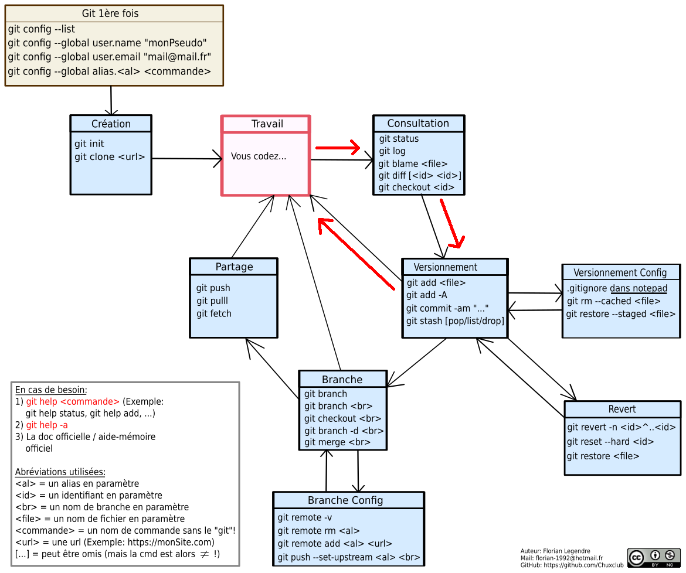

## Bienvenue sur la page Web de GitLearn!

Cette page web est destinée à vous proposer une série d'exercices en accompagnement des modules de formation.

Le module 0 de présentation des VCS étant un module très théorique je n'ai pas vraiment de manipulation technique à proposer. Il s'agit essentiellement de bien comprendre les notions de versionnement, de branches de versions (avec tout ce que ça implique: les fusions de branches, etc.) et de conflits.

Une fois que ce module 0 aura été bien compris, téléchargez et installez Git Bash (utilisateurs Windows) ou Git (utilisateurs Linux) en suivant ce [lien vers le site officiel de Git](https://git-scm.com/) et rejoignez-nous ici!

##### Table des matières
- [Bienvenue sur la page Web de GitLearn!](#bienvenue)
  * [Les terminaux de commande ou CLI](#les-terminaux)
  * [Git : mode d'emploi pour un usage seul, sans dépôt distant, sur une seule branche](#git1)
    + [Configuration de Git](#configuration)
    + [Boucle locale de travail](#boucle_locale)
    + [Consulter des versions](#log)
    + [Supprimer des versions](#revert)
  * [Git : mode d'emploi pour un usage seul, sans dépôt distant, avec une ou plusieurs branches](#git2)
  * [Git : mode d'emploi pour un usage seul, avec dépôt distant](#git3)
  * [Git : mode d'emploi pour un usage collaboratif](#git4)

<!-- ======================================================================= -->
<!--                              Module 0-1                                 -->
<!-- ======================================================================= -->
### Les terminaux de commande ou CLI 
[Retour à la table des matières](#bienvenue)

Dans Windows ouvrez Git Bash ou un terminal de commande sous Linux (Ctrl + Alt + T). Vous devriez obtenir une fenêtre similaire à celle-ci:

Notez la tilde bleue ~. Cette tidle signifie "HOME" sous Linux. C'est votre dossier HOME. Sous Windows vous aurez probablement un chemin absolu ressemblant à C:\mon\chemin\vers\home.

Vous allez apprendre à vous déplacer dans l'arborescence de vos fichiers dans un terminal. C'est une compétence essentielle pour apprendre Git. En effet, pour utiliser Git sur votre projet il faut vous rendre là où se trouve votre projet. Heureusement deux commandes suffisent à atteindre n'importe quel dossier d'une arborescence.

###### Exercice

- [ ] Dans votre terminal ou votre git bash tapez `ls` puis entrez.

Le résultat de la commande `ls` chez moi donne:

Il ne vous reste plus qu'à taper `cd` suivi du nom du dossier dans lequel vous voulez aller.

###### Exercice

- [ ] Changez de dossier avec la commande `cd`

Pour revenir au dossier précédent entez `cd -`, pour remonter d'un dossier parent dans l'arborescence entrez `cd ..`, pour monter de deux parents entrez `cd ../../`, etc.

###### Exercice

- [ ] Revenez au dossier précédent avec `cd -`
- [ ] Remontez dans le dossier parent avec `cd ..`
- [ ] Remontez au 3ième dossier parent avec `cd ../../../`

<ins>Note:</ins> Si par malheur un de vos dossier commence par le caractère "-" vous pouvez échapper à votre funeste sort en "échappant" le tiret par un antislash, comme ceci: `cd \-nomDossierAvecTiret`.

<!-- ======================================================================= -->
<!--                                Module 1                                 -->
<!-- ======================================================================= -->
### Git : mode d'emploi pour un usage seul, sans dépôt distant, sur une seule branche 
[Retour à la table des matières](#bienvenue)

Nous rentrons maintenant dans le vif du sujet. Tout ce que nous avons fait avant était pour nous préparer théoriquement et maintenant vous êtes fin prêt à la pratique!

#### Configuration de Git 

La première fois que vous utilisez Git vous devrez lui fournir une configuration minimum avant d'utiliser ses services. Il vous faut ainsi lui donner votre nom et votre adresse mail. Comme dit dans les diapos c'est une question de responsabilité! Et Git ne peut pas trouver ces données tout seul.

###### Exercice
- [ ] Entrez `git config --global user.name "votreNomUtilisateur"`
- [ ] Entrez `git config --global user.email "votreMail@votreMail.com"`

Pour éviter de vous retrouver accidentellement "piégés" dans Vim lors d'un commit je vous recommande également de configurer l'éditeur de texte utilisé pour écrire les messages des commits.

Renseignez-vous ici pour votre éditeur préféré: [Page officielle](https://git-scm.com/book/fr/v2/Commandes-Git-Installation-et-configuration)

###### Exercice
Utilisateurs Windows, selon l'emplacement de votre WordPad:
- [ ] Entrez `git config --global core.editor "'C:\Program Files\Windows NT\Accessories\wordpad.exe'"`
- [ ] Ou entrez `git config --global core.editor "'C:\Program Files (x86)\Windows NT\Accessories\wordpad.exe'"`

Pour les utilisateurs Linux: RTFM ([Page officielle](https://git-scm.com/book/fr/v2/Commandes-Git-Installation-et-configuration)) :smile:

###### Exercice
Vous pouvez sauter cet exercice pour l'instant. Revenez-y quand vous vous serez lassés d'écrire en boucle "status" et "commit" en toutes lettres :wink: :

- [ ] Créez l'alias pour la commande checkout
- [ ] Créez l'alias pour la commande branch
- [ ] Créez l'alias pour la commande commit
- [ ] Créez l'alias pour la commande status

#### La boucle locale de travail 

On rappelle la boucle de travail locale:

Nous allons travailler cette boucle sur un projet test.

###### Exercice
- [ ] Créez un dossier test
- [ ] Dans votre dossier test lancez la commande `git init`
- [ ] Lancez un premier `git status` (ou `git st` si vous avez défini l'alias) puis lisez le message que Git affiche.
- [ ] Créez un fichier test.txt, écrivez "Hello World!" dedans puis sauvegardez
- [ ] Relancez un `git status`. Comme précédemment lisez le message
- [ ] Ajoutez le fichier au suivi en utilisant la commande que Git vous propose
- [ ] Relancez un `git status` et lisez le message
- [ ] Faites votre premier commit
- [ ] Relancez un `git status` et lisez le message

Comme vous pouvez déjà le constater la commande `git status` est une commande __très__ utilisée! Elle vous permet de savoir quels fichiers sont suivis ou non, lesquels sont ajoutés au staging ou non, etc. Utilisez-la autant que possible!

###### Exercice
- [ ] Admirez votre premier commit avec la commande `git log`
- [ ] Créez un autre fichier test2.txt dans lequel vous écrirez "Hello Everyone!"
- [ ] Faites une modification dans votre premier fichier test.txt
- [ ] Faites un `git status` et lisez le message
- [ ] Faites un `git add -A` suivi d'un `git status`. Que constatez-vous?
- [ ] Retirez test2.txt du suivi des modifications avec la commande `git rm --cached test2.txt`
- [ ] Faites un commit puis un `git status`. Que constatez-vous?

La commande `git rm --cached <nomFichier>` n'est pas la commande que vous utiliserez le plus mais elle est très utile dès lors qu'on veut retirer un fichier du suivi comme un fichier binaire inutile, une fichier trop lourd (500Mo) pour être partagé, etc.

Vous remarquerez également une problème: tant qu'on n'a pas dit à Git d'ignorer le fichier test2.txt on ne pourra pas utiliser la commande `git add -A` qui est pourtant bien pratique.

Pour dire à git d'ignorer ce fichier on va créer un fichier .gitignore.

:warning: Le nom du fichier est obligatoirement __.gitignore__. Ce n'est pas .gitignore.txt ou gitignore. Le "." devant le nom du fichier indique qu'il s'agit d'un fichier caché. Pour les utilisateurs Windows: vous devrez activer l'option d'affichage des fichiers cachés. De plus, vous devrez vous assurer qu'aucune extension automatique .txt ne s'est ajoutée et l'éliminer si c'est le cas!

###### Exercice
- [ ] Créez le fichier .gitignore
- [ ] Écrivez test2.txt dans ce .gitignore et enregistrez
- [ ] Lancez un `git status`. Que constatez-vous?
- [ ] Ajoutez votre .gitignore au suivi des modifications et commitez

Merci à vous d'être arrivé jusqu'ici! Vous avez maintenant toutes les commandes de la boucle locale de travail! Vous pouvez d'ores et déjà versionner n'importe lequel de vos projets! :smiley:

#### Consulter des versions 

La commande `git blame <nomFichier>` permet de savoir qui a fait quoi sur un fichier donné avec une très grande précision. Mais pour l'instant vous travaillez seul, aussi cette commande n'a que peu d'intérêt pour le moment. En revanche maintenant que nous avons quelques commits nous allons explorer l'historique des versions.

###### Exercice
- [ ] Entrez `git log` pour lire l'historique des versions de votre projet test
- [ ] Entrez la commande `git diff` en passant deux versions de votre choix en paramètre. Inversez ces deux paramètres. Que constatez-vous?
- [ ] Essayez d'obtenir le même affichage mais avec un chemin relatif vers ces versions. Qu'est-ce qui vous paraît le plus pratique?
- [ ] Entrez la commande `git diff` sans arguments. Faites quelques modifications dans test.txt puis entrez de nouveau la commande `git diff` sans arguments. Que constatez-vous?
- [ ] Faites un `git status`
- [ ] Restaurez le fichier test.txt avec la commande `git restore <nomFichier>`
- [ ] Refaites un `git status`

Il se peut que vous ayiez envie de "visiter" votre projet dans une version antérieure sans avoir à passer par la commande `git diff`.

###### Exercice
- [ ] Entrez `git log`
- [ ] Choisissez une version antérieure puis utilisez la commande `git checkout` pour vous y rendre en utilisant l'identifiant de la version
- [ ] Refaites un `git log` pendant que vous êtes sur cette ancienne version. Que constatez-vous?
- [ ] Revenez à votre tout dernier commit en utilisant le nom de la branche sur laquelle vous êtes (`git branch` pour obtenir la liste de vos branches et celles sur laquelle vous vous trouvez)
- [ ] Essayez de revenir à cette même version antérieure en utilisant un chemin relatif vers le commit que vous avez choisi puis revenez à votre tout dernier commit comme précédemment

#### Supprimer des versions 

Il arrive parfois qu'on veuille annuler un changement. Pour ce faire il y a plusieurs méthodes. L'une de ces méthodes est la méthode "sûre" car elle ne fait qu'enrichir l'historique des versions en ajoutant des versions enregistrant vos annulations. Cette méthode est celle de la commande `git revert <id>`

###### Exercice
- [ ] Créez un fichier testRevert.txt
- [ ] Écrivez dedans 'toto' puis commitez. Écrivez ensuite 'titi' et commitez. Écrivez 'tata' et commitez. Enfin écrivez 'tutu' et commitez
- [ ] Entrez `git log` pour que vous constatiez l'état courant de votre historique
- [ ] Choisissez le tout dernier commit parmi ceux que vous venez d'ajouter et faites un `git revert` avec l'identifiant de ce commit
- [ ] Refaites un `git log`
- [ ] Annulez le tout dernier commit en utilisant un chemin relatif vers le commit cette fois-ci
- [ ] Refaites un `git log`

<!-- ======================================================================= -->
<!--                                Module 2                                 -->
<!-- ======================================================================= -->
### Git : mode d'emploi pour un usage seul, sans dépôt distant, avec une ou plusieurs branches 
[Retour à la table des matières](#bienvenue-sur-la-page-web-de-gitlearn-)

<!-- ======================================================================= -->
<!--                                Module 3                                 -->
<!-- ======================================================================= -->
### Git : mode d'emploi pour un usage seul, avec dépôt distant
[Retour à la table des matières](#bienvenue)

<!-- ======================================================================= -->
<!--                                Module 4                                 -->
<!-- ======================================================================= -->
### Git : mode d'emploi pour un usage collaboratif
[Retour à la table des matières](#bienvenue)
